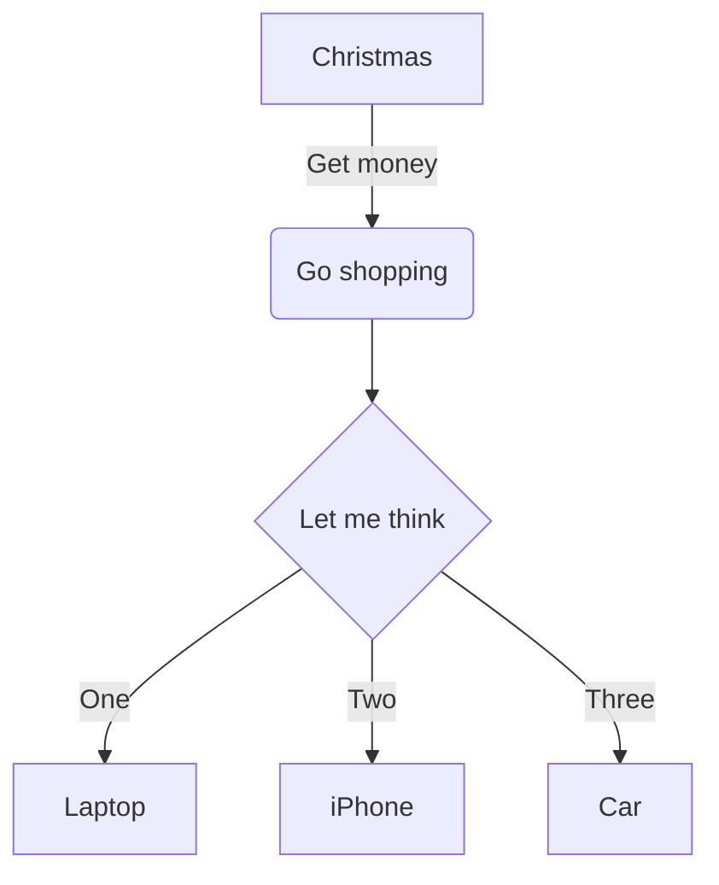

# mermaid-playground

## Mermaid diagram with icons
[!IMPORTANT]
Custom Iconify packs require a custom Mermaid configuration. On GitHub, these icons may render as text labels (e.g., "i:logos:react") because GitHub's environment is sandboxed.

# Other examples

## Latex example
This is an inline equation: $$V_{sphere} = \frac{4}{3}\pi r^3$$, 
followed by a display style equation:

$$V_{sphere} = \frac{4}{3}\pi r^3$$

