# mermaid-playground

Playground to see what diagram types render in markdown, for testing markdown editors and GitHub.

## Category 1: Diagramming Tools

### 1.1 Mermaid.js

Renders natively on GitHub, GitLab, Notion, Obsidian, JetBrains, and via VS Code extensions.

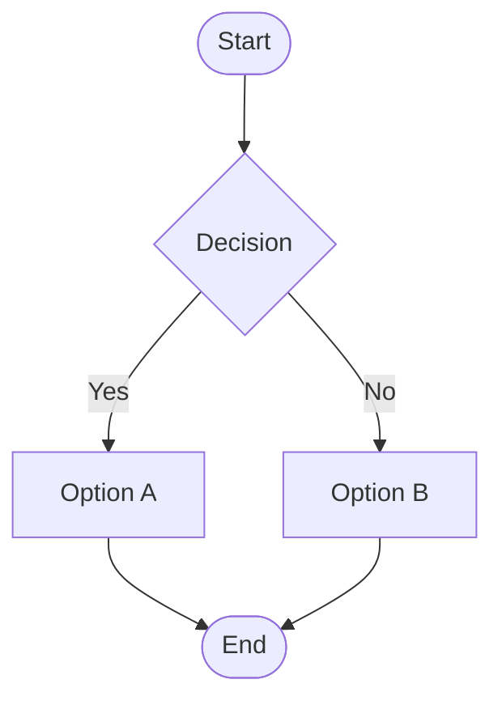

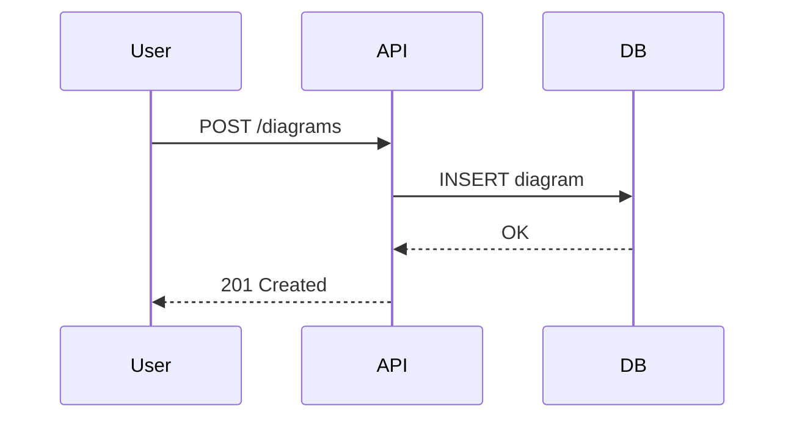

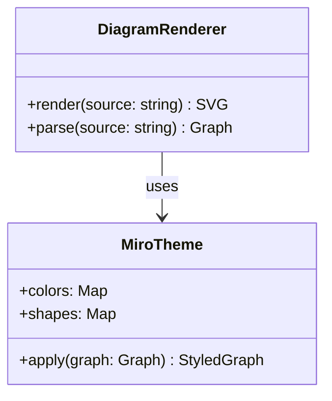

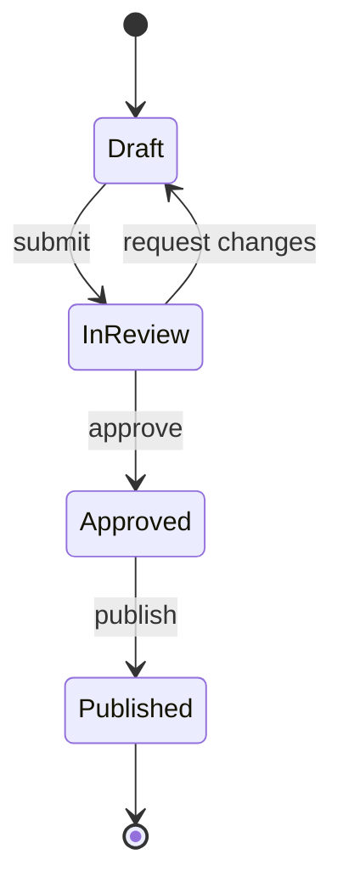

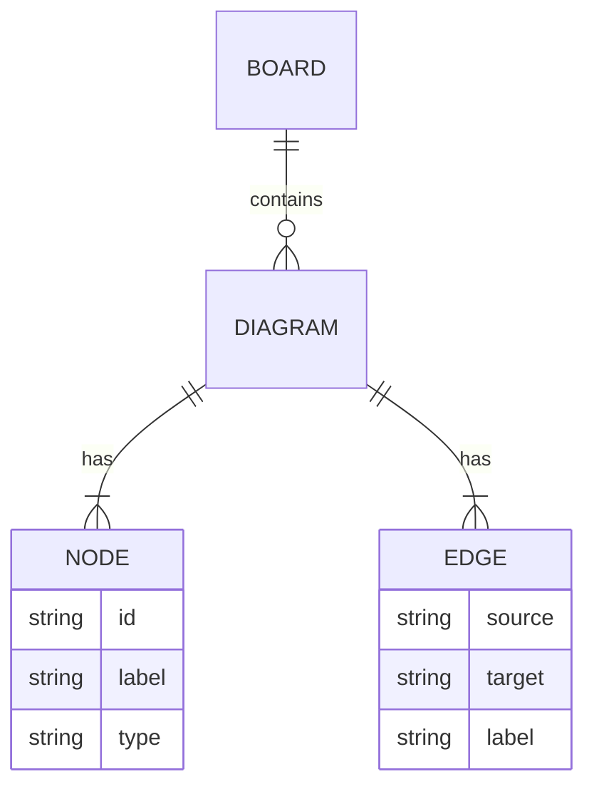

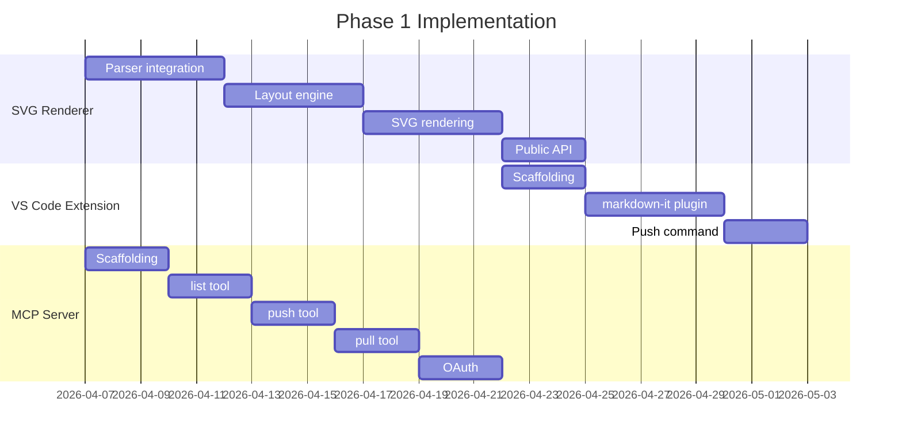

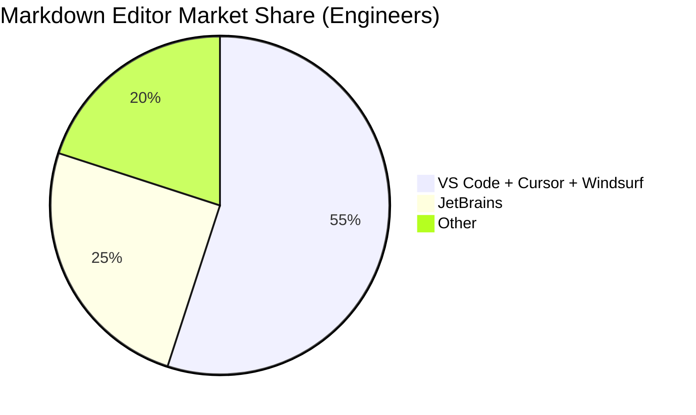

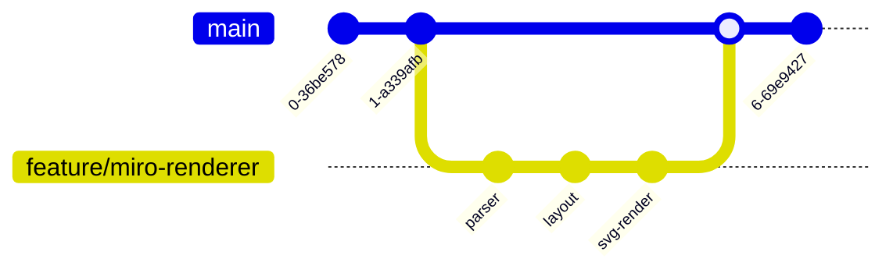

Mermaid supports icons via the `iconify` integration (requires Mermaid v11+). Icons are referenced with `::icon()` syntax or the newer architecture diagram syntax:

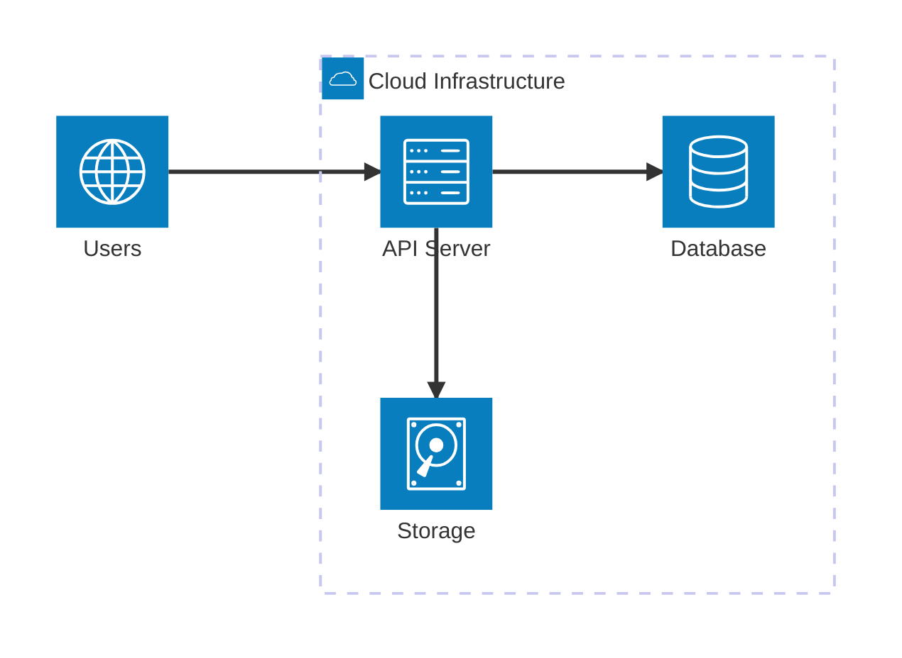

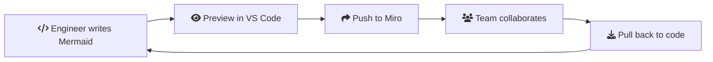

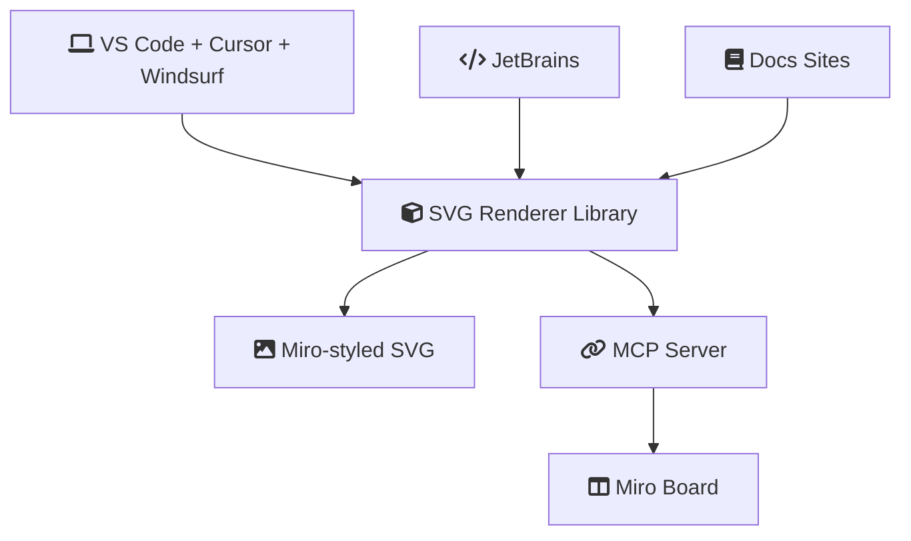

Note: Icon support varies by platform. Font Awesome icons (`fa:fa-*`) work in most Mermaid renderers. The `architecture-beta` diagram type is newer and may not be supported everywhere yet.

### 1.2 PlantUML

Requires a PlantUML server or VS Code extension (jebbs.plantuml). Does NOT render on GitHub.

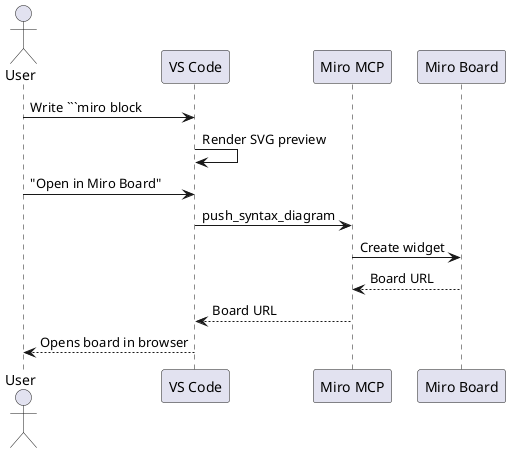

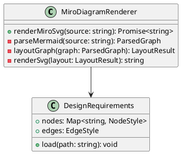

### 1.3 Graphviz / DOT

Renders in VS Code via extensions (e.g. Graphviz Markdown Preview). Does NOT render on GitHub.

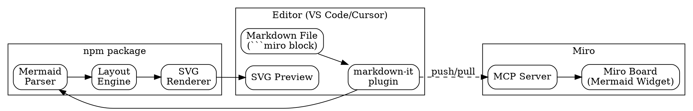

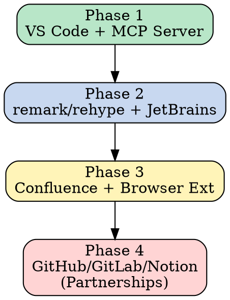

### 1.4 D2 (Terrastruct)

Renders in VS Code via the D2 extension. Does NOT render on GitHub.

```d2
direction: right

editor: VS Code {
  md: Markdown File
  plugin: markdown-it plugin
  preview: SVG Preview
}

lib: Renderer Library {
  parser: Mermaid Parser
  layout: Layout Engine
  svg: SVG Renderer
}

miro: Miro {
  mcp: MCP Server
  board: Board (Widget)
}

editor.md -> editor.plugin -> lib.parser -> lib.layout -> lib.svg -> editor.preview
editor.plugin -> miro.mcp: push/pull {style.stroke-dash: 3}
miro.mcp -> miro.board
```

### 1.5 Nomnoml

Renders via Kroki or dedicated extensions. Does NOT render on GitHub.

```nomnoml
[<frame>Miro Diagram Rendering|
  [Editor] -> [markdown-it plugin]
  [markdown-it plugin] -> [Mermaid Parser]
  [Mermaid Parser] -> [Layout Engine]
  [Layout Engine] -> [SVG Renderer]
  [SVG Renderer] -> [Preview Pane]
  [markdown-it plugin] --> [MCP Server]
  [MCP Server] --> [Miro Board]
]
```

### 1.6 WaveDrom (Digital Timing Diagrams)

Niche - for hardware/digital design. Renders via Kroki.

```wavedrom
{ "signal": [
  { "name": "push",  "wave": "0.1..0.1..0" },
  { "name": "render","wave": "0..1..0.1.0" },
  { "name": "pull",  "wave": "0....1..0.." },
  { "name": "sync",  "wave": "0.......1.0" }
]}
```

---

## Category 2: Non-Diagramming Rendered Content

### 2.1 Math / LaTeX

Renders natively on GitHub (since May 2022), Obsidian, Jupyter, and most docs generators.

Inline math: The rendering time complexity is $O(n \log n)$ where $n$ is the number of nodes.

Block math:

$$
SVG_{output} = \sum_{i=1}^{N} \text{renderNode}(n_i) + \sum_{j=1}^{M} \text{renderEdge}(e_j)
$$

$$
\text{Layout}(G) = \arg\min_{pos} \sum_{(u,v) \in E} \|pos(u) - pos(v)\|^2
$$

### 2.2 GeoJSON

Renders natively on GitHub (code fence since March 2022).

```geojson
{
  "type": "FeatureCollection",
  "features": [
    {
      "type": "Feature",
      "properties": { "name": "Miro HQ (Amsterdam)", "marker-color": "#FFD02F" },
      "geometry": { "type": "Point", "coordinates": [4.9041, 52.3676] }
    },
    {
      "type": "Feature",
      "properties": { "name": "San Francisco Office", "marker-color": "#FFD02F" },
      "geometry": { "type": "Point", "coordinates": [-122.4194, 37.7749] }
    }
  ]
}
```

### 2.3 TopoJSON

Renders natively on GitHub (code fence since March 2022).

```topojson
{
  "type": "Topology",
  "objects": {
    "example": {
      "type": "GeometryCollection",
      "geometries": [
        {
          "type": "Point",
          "coordinates": [4.9041, 52.3676],
          "properties": { "name": "Amsterdam" }
        }
      ]
    }
  }
}
```

### 2.4 STL (3D Models)

Renders natively on GitHub (code fence since March 2022). Only ASCII STL, not binary.

```stl
solid cube
  facet normal 0 0 -1
    outer loop
      vertex 0 0 0
      vertex 1 0 0
      vertex 1 1 0
    endloop
  endfacet
  facet normal 0 0 -1
    outer loop
      vertex 0 0 0
      vertex 1 1 0
      vertex 0 1 0
    endloop
  endfacet
  facet normal 0 0 1
    outer loop
      vertex 0 0 1
      vertex 1 1 1
      vertex 1 0 1
    endloop
  endfacet
  facet normal 0 0 1
    outer loop
      vertex 0 0 1
      vertex 0 1 1
      vertex 1 1 1
    endloop
  endfacet
  facet normal 0 -1 0
    outer loop
      vertex 0 0 0
      vertex 1 0 1
      vertex 1 0 0
    endloop
  endfacet
  facet normal 0 -1 0
    outer loop
      vertex 0 0 0
      vertex 0 0 1
      vertex 1 0 1
    endloop
  endfacet
  facet normal 1 0 0
    outer loop
      vertex 1 0 0
      vertex 1 0 1
      vertex 1 1 1
    endloop
  endfacet
  facet normal 1 0 0
    outer loop
      vertex 1 0 0
      vertex 1 1 1
      vertex 1 1 0
    endloop
  endfacet
  facet normal 0 1 0
    outer loop
      vertex 0 1 0
      vertex 1 1 0
      vertex 1 1 1
    endloop
  endfacet
  facet normal 0 1 0
    outer loop
      vertex 0 1 0
      vertex 1 1 1
      vertex 0 1 1
    endloop
  endfacet
  facet normal -1 0 0
    outer loop
      vertex 0 0 0
      vertex 0 1 0
      vertex 0 1 1
    endloop
  endfacet
  facet normal -1 0 0
    outer loop
      vertex 0 0 0
      vertex 0 1 1
      vertex 0 0 1
    endloop
  endfacet
endsolid cube
```

### 2.5 Markmap (Mind Maps from Markdown)

Renders in VS Code via the Markmap extension. Does NOT render on GitHub.

```markmap
# Miro Markdown Tag

## Architecture
### SVG Renderer Library
- Mermaid parser
- Layout engine
- SVG generation
### Widget Renderer
- Miro shapes
- Bi-directional editing
### Platform Plugins
- VS Code
- JetBrains
- remark/rehype
### MCP Server
- push_syntax_diagram
- pull_syntax_diagram
- list_syntax_diagrams

## Phasing
### Phase 1
- VS Code extension
- MCP server
### Phase 2
- remark/rehype
- JetBrains
### Phase 3
- Confluence
- Browser extension
### Phase 4
- GitHub partnership
- GitLab partnership
- Notion partnership
```

---

## Rendering Support Matrix

Which examples render where:

| Example | GitHub | VS Code (with extensions) | GitLab | Obsidian |
|---|---|---|---|---|
| Mermaid | Yes | Yes | Yes | Yes |
| PlantUML | No | Yes (jebbs.plantuml) | Yes | Via plugin |
| Graphviz/DOT | No | Yes (graphviz-markdown-preview) | No | Via plugin |
| D2 | No | Yes (terrastruct.d2) | No | Via plugin |
| Nomnoml | No | Via Kroki | No | No |
| WaveDrom | No | Via Kroki | No | No |
| Math/LaTeX | Yes | Yes (KaTeX extensions) | Yes | Yes |
| GeoJSON | Yes | No | No | No |
| TopoJSON | Yes | No | No | No |
| STL | Yes | No | No | No |
| Markmap | No | Yes (markmap extension) | No | Via plugin |
