# ELK vs Dagre: Mermaid Diagram Comparison

A collection of mermaid diagrams that highlight where each layout engine shines and where it breaks down.

---

## ELK Wins

### 1. Wide graph with many cross-edges

Dagre produces overlapping edges and cramped nodes. ELK's layered algorithm spaces things cleanly.

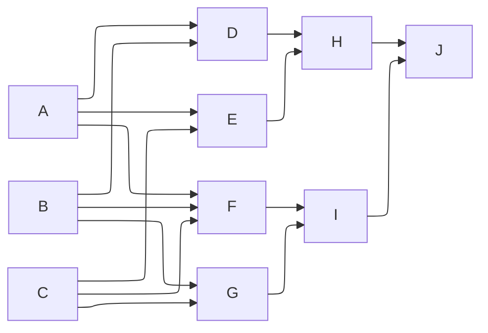
```mermaid
---
config:
  layout: elk
---
graph LR
    A --> D
    A --> E
    A --> F
    B --> D
    B --> F
    B --> G
    C --> E
    C --> F
    C --> G
    D --> H
    E --> H
    F --> I
    G --> I
    H --> J
    I --> J
```

Dagre version (overlapping edges):

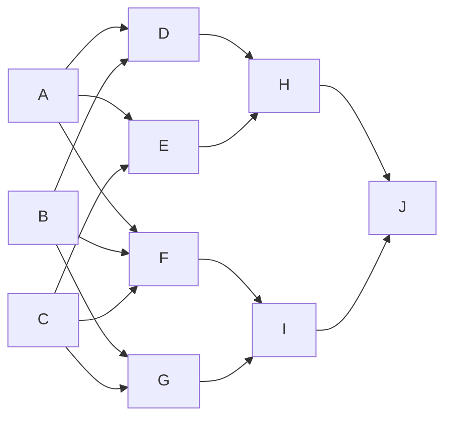
```mermaid
graph LR
    A --> D
    A --> E
    A --> F
    B --> D
    B --> F
    B --> G
    C --> E
    C --> F
    C --> G
    D --> H
    E --> H
    F --> I
    G --> I
    H --> J
    I --> J
```

---

### 2. Deep hierarchy with subgraphs

ELK handles nested subgraphs with proper containment. Dagre often collapses or misaligns nested groups.

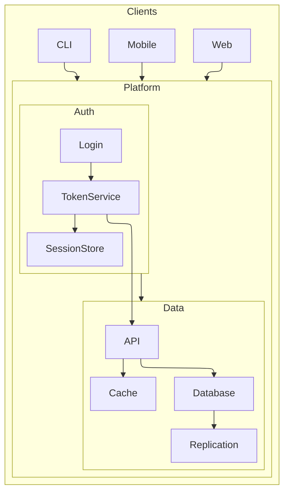
```mermaid
---
config:
  layout: elk
---
graph TB
    subgraph Platform
        subgraph Auth
            Login --> TokenService
            TokenService --> SessionStore
        end
        subgraph Data
            API --> Database
            API --> Cache
            Database --> Replication
        end
        Auth --> Data
        TokenService --> API
    end
    subgraph Clients
        Web --> Platform
        Mobile --> Platform
        CLI --> Platform
    end
```

Dagre version (subgraph nesting breaks):

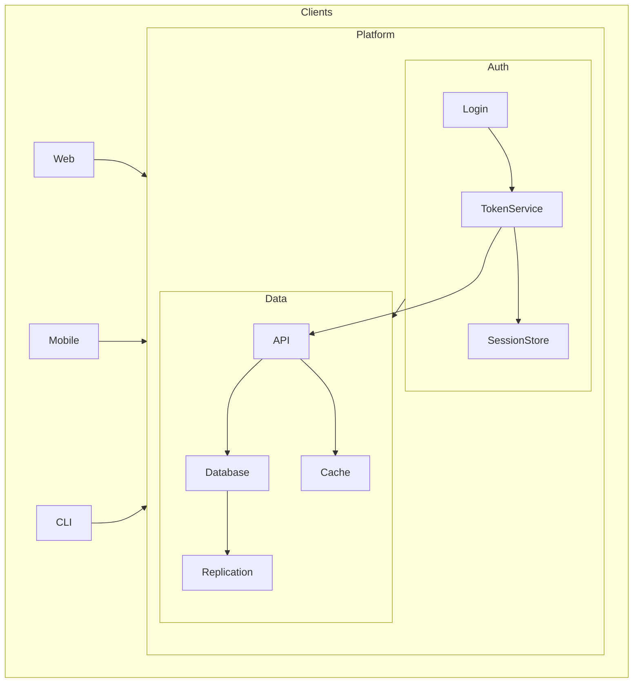
```mermaid
graph TB
    subgraph Platform
        subgraph Auth
            Login --> TokenService
            TokenService --> SessionStore
        end
        subgraph Data
            API --> Database
            API --> Cache
            Database --> Replication
        end
        Auth --> Data
        TokenService --> API
    end
    subgraph Clients
        Web --> Platform
        Mobile --> Platform
        CLI --> Platform
    end
```

---

### 3. Bidirectional / cyclic flows

ELK handles back-edges and cycles gracefully. Dagre struggles with edge routing when arrows go "against" the flow direction.

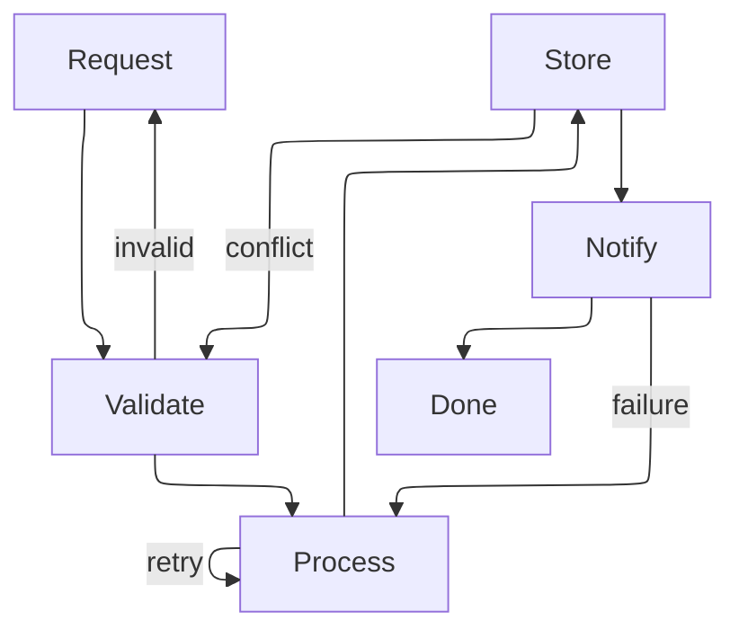
```mermaid
---
config:
  layout: elk
---
graph TD
    Request --> Validate
    Validate --> Process
    Process --> Store
    Store --> Notify
    Notify --> Done
    Validate -->|invalid| Request
    Process -->|retry| Process
    Store -->|conflict| Validate
    Notify -->|failure| Process
```

Dagre version (back-edges overlap nodes):

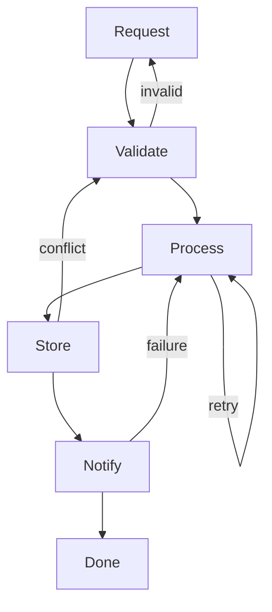
```mermaid
graph TD
    Request --> Validate
    Validate --> Process
    Process --> Store
    Store --> Notify
    Notify --> Done
    Validate -->|invalid| Request
    Process -->|retry| Process
    Store -->|conflict| Validate
    Notify -->|failure| Process
```

---

### 4. Large fan-out / fan-in (microservices)

ELK distributes nodes evenly. Dagre stacks them vertically creating a very tall, narrow diagram.

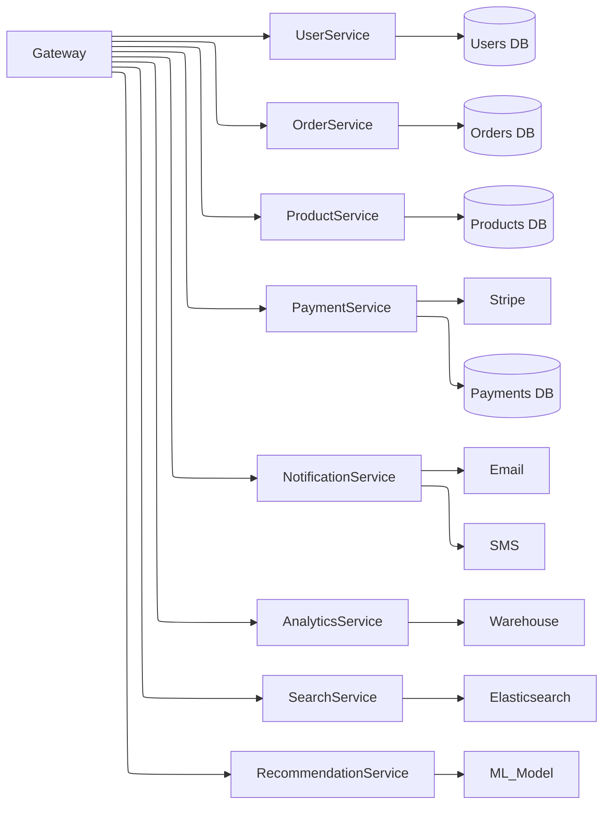
```mermaid
---
config:
  layout: elk
---
graph LR
    Gateway --> UserService
    Gateway --> OrderService
    Gateway --> ProductService
    Gateway --> PaymentService
    Gateway --> NotificationService
    Gateway --> AnalyticsService
    Gateway --> SearchService
    Gateway --> RecommendationService
    UserService --> DB1[(Users DB)]
    OrderService --> DB2[(Orders DB)]
    ProductService --> DB3[(Products DB)]
    PaymentService --> Stripe
    PaymentService --> DB4[(Payments DB)]
    NotificationService --> Email
    NotificationService --> SMS
    AnalyticsService --> Warehouse
    SearchService --> Elasticsearch
    RecommendationService --> ML_Model
```

Dagre version (tall and narrow, hard to read):

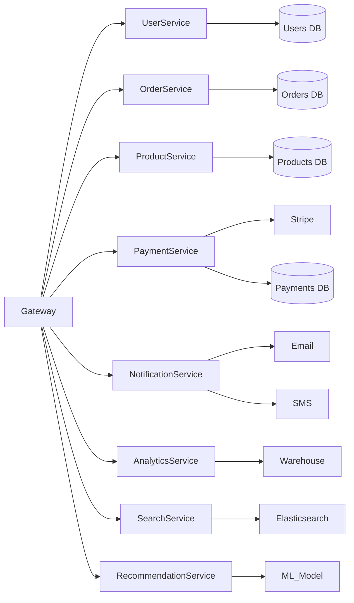
```mermaid
graph LR
    Gateway --> UserService
    Gateway --> OrderService
    Gateway --> ProductService
    Gateway --> PaymentService
    Gateway --> NotificationService
    Gateway --> AnalyticsService
    Gateway --> SearchService
    Gateway --> RecommendationService
    UserService --> DB1[(Users DB)]
    OrderService --> DB2[(Orders DB)]
    ProductService --> DB3[(Products DB)]
    PaymentService --> Stripe
    PaymentService --> DB4[(Payments DB)]
    NotificationService --> Email
    NotificationService --> SMS
    AnalyticsService --> Warehouse
    SearchService --> Elasticsearch
    RecommendationService --> ML_Model
```

---

### 5. Complex state machine with many transitions

ELK's orthogonal edge routing keeps transition lines clean. Dagre produces spaghetti.

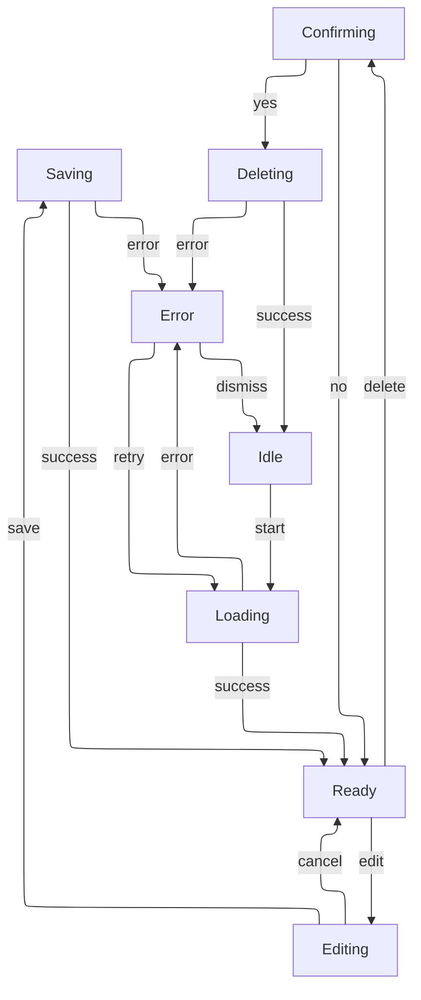
```mermaid
---
config:
  layout: elk
---
graph TD
    Idle -->|start| Loading
    Loading -->|success| Ready
    Loading -->|error| Error
    Ready -->|edit| Editing
    Ready -->|delete| Confirming
    Editing -->|save| Saving
    Editing -->|cancel| Ready
    Saving -->|success| Ready
    Saving -->|error| Error
    Confirming -->|yes| Deleting
    Confirming -->|no| Ready
    Deleting -->|success| Idle
    Deleting -->|error| Error
    Error -->|retry| Loading
    Error -->|dismiss| Idle
```

Dagre version (crossing edges):

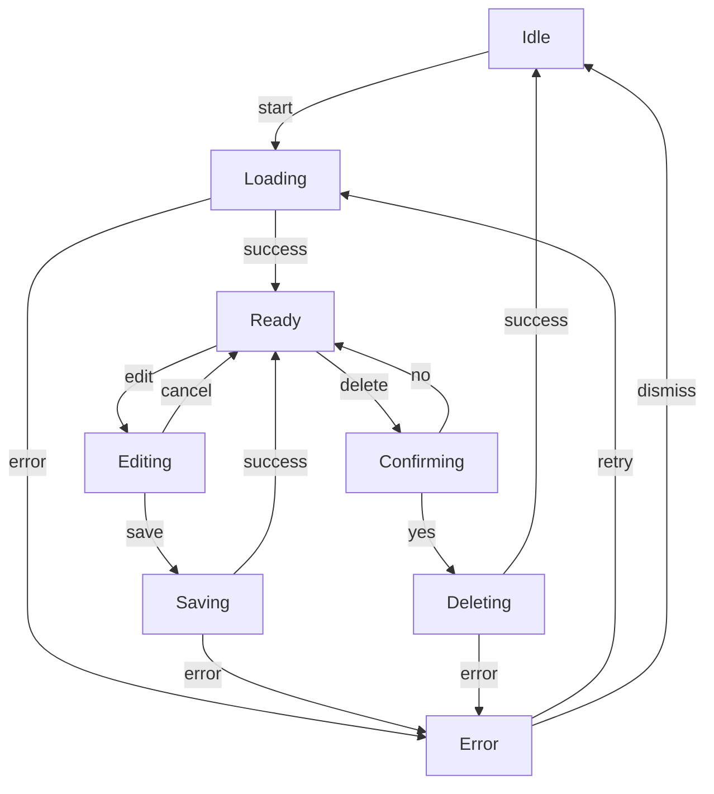
```mermaid
graph TD
    Idle -->|start| Loading
    Loading -->|success| Ready
    Loading -->|error| Error
    Ready -->|edit| Editing
    Ready -->|delete| Confirming
    Editing -->|save| Saving
    Editing -->|cancel| Ready
    Saving -->|success| Ready
    Saving -->|error| Error
    Confirming -->|yes| Deleting
    Confirming -->|no| Ready
    Deleting -->|success| Idle
    Deleting -->|error| Error
    Error -->|retry| Loading
    Error -->|dismiss| Idle
```

---

### 6. Parallel pipelines with sync points

ELK aligns parallel tracks and keeps sync edges horizontal. Dagre jumbles them.

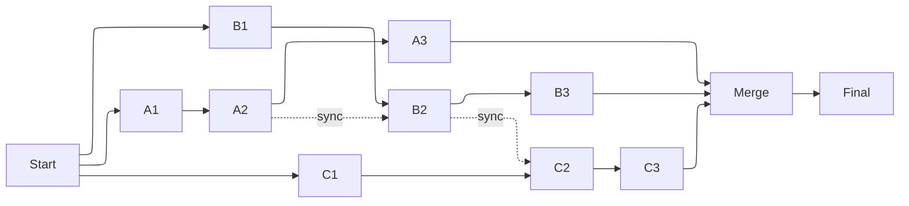
```mermaid
---
config:
  layout: elk
---
graph LR
    Start --> A1
    Start --> B1
    Start --> C1
    A1 --> A2 --> A3
    B1 --> B2 --> B3
    C1 --> C2 --> C3
    A3 --> Merge
    B3 --> Merge
    C3 --> Merge
    Merge --> Final
    A2 -.->|sync| B2
    B2 -.->|sync| C2
```

Dagre version (tracks not aligned):

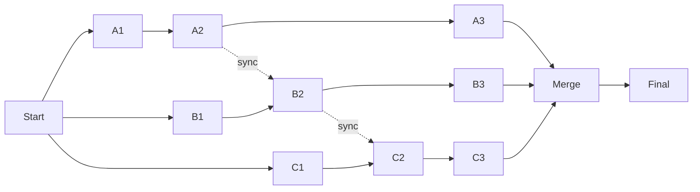
```mermaid
graph LR
    Start --> A1
    Start --> B1
    Start --> C1
    A1 --> A2 --> A3
    B1 --> B2 --> B3
    C1 --> C2 --> C3
    A3 --> Merge
    B3 --> Merge
    C3 --> Merge
    Merge --> Final
    A2 -.->|sync| B2
    B2 -.->|sync| C2
```

---

## Dagre Wins

### 7. Simple linear flowchart

Dagre renders this perfectly. ELK adds unnecessary spacing and sometimes over-distributes simple chains.

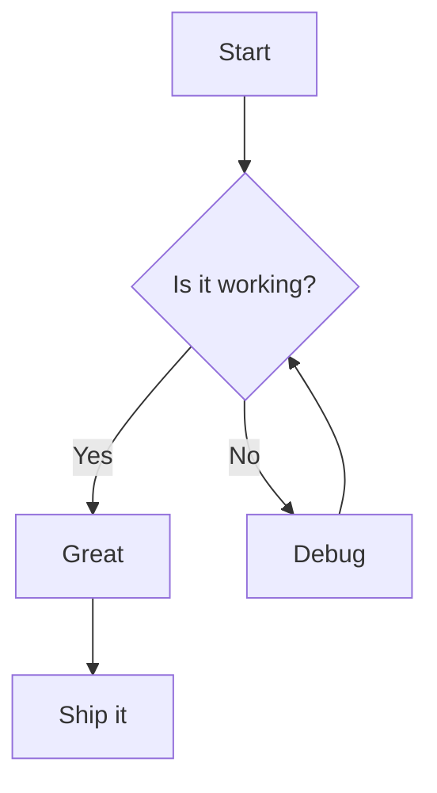
```mermaid
graph TD
    A[Start] --> B{Is it working?}
    B -->|Yes| C[Great]
    B -->|No| D[Debug]
    D --> B
    C --> E[Ship it]
```

ELK version (over-spaced, feels sparse):

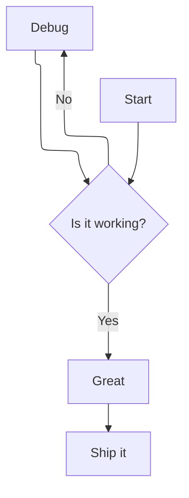
```mermaid
---
config:
  layout: elk
---
graph TD
    A[Start] --> B{Is it working?}
    B -->|Yes| C[Great]
    B -->|No| D[Debug]
    D --> B
    C --> E[Ship it]
```

---

### 8. Sequence-like top-down flow

Small sequential diagrams look compact and natural in Dagre. ELK spreads them out too much.

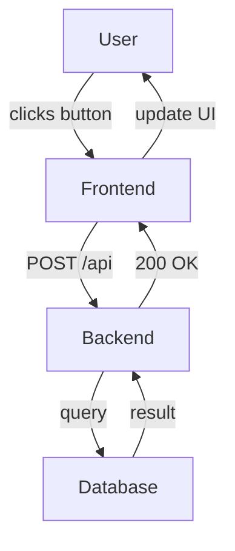
```mermaid
graph TD
    User -->|clicks button| Frontend
    Frontend -->|POST /api| Backend
    Backend -->|query| Database
    Database -->|result| Backend
    Backend -->|200 OK| Frontend
    Frontend -->|update UI| User
```

ELK version (too spread out):

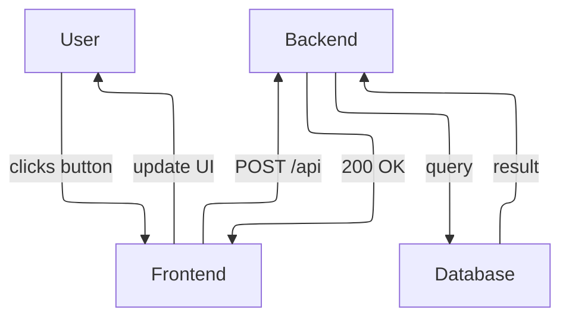
```mermaid
---
config:
  layout: elk
---
graph TD
    User -->|clicks button| Frontend
    Frontend -->|POST /api| Backend
    Backend -->|query| Database
    Database -->|result| Backend
    Backend -->|200 OK| Frontend
    Frontend -->|update UI| User
```

---

### 9. Simple decision tree

Dagre's compact layout makes small decision trees easy to scan. ELK creates too much whitespace.

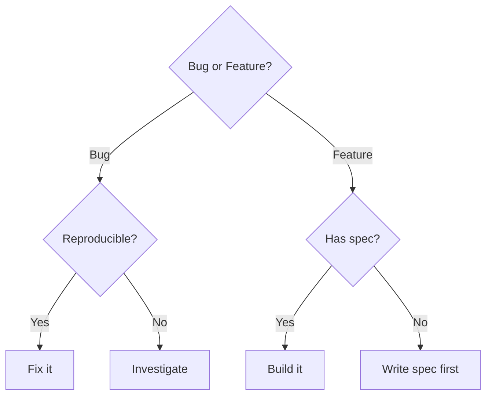
```mermaid
graph TD
    Q1{Bug or Feature?}
    Q1 -->|Bug| Q2{Reproducible?}
    Q1 -->|Feature| Q3{Has spec?}
    Q2 -->|Yes| Fix[Fix it]
    Q2 -->|No| Investigate[Investigate]
    Q3 -->|Yes| Build[Build it]
    Q3 -->|No| Write[Write spec first]
```

ELK version (excessive whitespace):

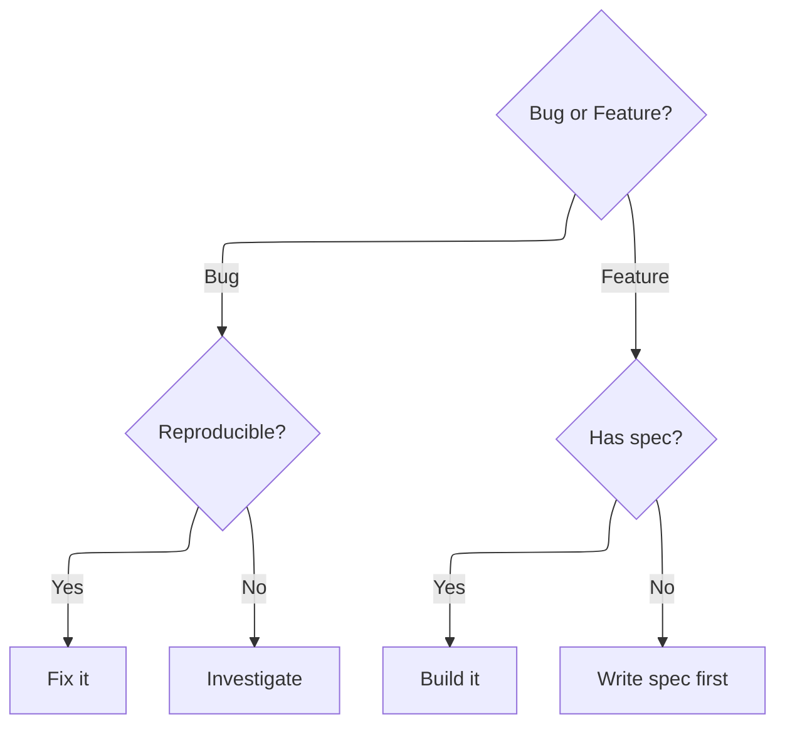
```mermaid
---
config:
  layout: elk
---
graph TD
    Q1{Bug or Feature?}
    Q1 -->|Bug| Q2{Reproducible?}
    Q1 -->|Feature| Q3{Has spec?}
    Q2 -->|Yes| Fix[Fix it]
    Q2 -->|No| Investigate[Investigate]
    Q3 -->|Yes| Build[Build it]
    Q3 -->|No| Write[Write spec first]
```

---

### 10. Minimal graph (2-5 nodes)

Dagre is perfect for tiny diagrams. ELK's algorithm overhead adds no value and can produce odd spacing.

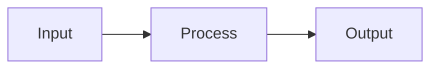
```mermaid
graph LR
    Input --> Process --> Output
```

ELK version:

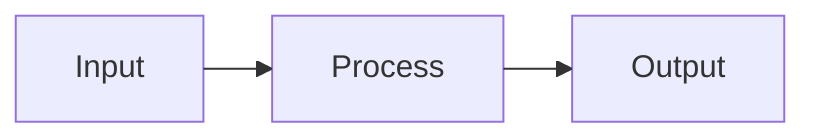
```mermaid
---
config:
  layout: elk
---
graph LR
    Input --> Process --> Output
```

---

### 11. Flowchart with long label text

Dagre handles node sizing for long text labels more predictably. ELK sometimes clips or misaligns text-heavy nodes.

```mermaid
graph TD
    A[User submits the registration form with all required fields] --> B{Are all validation rules satisfied including email format and password strength?}
    B -->|Yes| C[Create account in database and send verification email to user]
    B -->|No| D[Display specific validation error messages next to each invalid field]
    D --> A
```

ELK version (node sizing can be inconsistent):

```mermaid
---
config:
  layout: elk
---
graph TD
    A[User submits the registration form with all required fields] --> B{Are all validation rules satisfied including email format and password strength?}
    B -->|Yes| C[Create account in database and send verification email to user]
    B -->|No| D[Display specific validation error messages next to each invalid field]
    D --> A
```

---

## Edge Cases - Both Struggle

### 12. Massive graph (stress test)

Both engines struggle here, but in different ways. ELK is slower to render but produces a more readable result. Dagre is faster but the layout is messier.

```mermaid
graph TD
    A --> B & C & D
    B --> E & F
    C --> F & G & H
    D --> H & I
    E --> J
    F --> J & K
    G --> K & L
    H --> L & M
    I --> M & N
    J --> O
    K --> O & P
    L --> P & Q
    M --> Q & R
    N --> R
    O --> S
    P --> S
    Q --> S
    R --> S
    S --> T[End]
```

---

## Direction Comparison (TB vs LR vs BT vs RL)

The same graph rendered in all four directions. Some graphs naturally suit one direction over others.

### 13. Org chart - TB (top-down) vs LR (left-right)

Org charts are naturally top-down. LR makes them awkward to read.

**TB (natural for hierarchies):**

```mermaid
graph TB
    CEO --> CTO
    CEO --> CPO
    CEO --> CFO
    CTO --> Engineering
    CTO --> Infrastructure
    CPO --> Design
    CPO --> Research
    CFO --> Finance
    CFO --> Legal
```

**LR (hierarchy reads oddly left-to-right):**

```mermaid
graph LR
    CEO --> CTO
    CEO --> CPO
    CEO --> CFO
    CTO --> Engineering
    CTO --> Infrastructure
    CPO --> Design
    CPO --> Research
    CFO --> Finance
    CFO --> Legal
```

---

### 14. Pipeline / data flow - LR vs TB

Pipelines and data flows read naturally left-to-right, like a timeline. TB makes them unnecessarily tall.

**LR (natural for pipelines):**

```mermaid
graph LR
    Raw[Raw Data] --> Ingest --> Validate --> Transform --> Enrich --> Store[(Data Lake)] --> Serve
```

**TB (pipeline becomes a tall column):**

```mermaid
graph TB
    Raw[Raw Data] --> Ingest --> Validate --> Transform --> Enrich --> Store[(Data Lake)] --> Serve
```

---

### 15. Bottom-up: dependency / import graph

Dependency graphs often make more sense bottom-up - the foundation is at the bottom, higher-level modules on top.

**BT (dependencies flow upward, natural):**

```mermaid
graph BT
    Utils --> Core
    Core --> Services
    Services --> API
    Services --> Workers
    API --> App
    Workers --> App
    Config --> Core
    Config --> Services
```

**TB (dependencies flow downward, inverted mental model):**

```mermaid
graph TB
    Utils --> Core
    Core --> Services
    Services --> API
    Services --> Workers
    API --> App
    Workers --> App
    Config --> Core
    Config --> Services
```

---

### 16. Right-to-left: RTL language or reverse flow

RL is niche but useful for showing reverse flows like rollback procedures or RTL-reading contexts.

**RL (rollback / undo flow):**

```mermaid
graph RL
    Production -->|rollback| Staging
    Staging -->|revert| QA
    QA -->|reset| Dev
    Dev -->|restore| Backup
```

**LR (same flow, but direction fights the semantics):**

```mermaid
graph LR
    Production -->|rollback| Staging
    Staging -->|revert| QA
    QA -->|reset| Dev
    Dev -->|restore| Backup
```

---

### 17. Same complex graph in all four directions

A CI/CD pipeline shown in each direction to compare readability.

**TD (top-down):**

```mermaid
graph TD
    Push[Git Push] --> Lint & Test & Build
    Lint --> Gate{All pass?}
    Test --> Gate
    Build --> Gate
    Gate -->|Yes| Deploy[Deploy to Staging]
    Gate -->|No| Notify[Notify Dev]
    Deploy --> Smoke[Smoke Tests]
    Smoke -->|Pass| Prod[Promote to Prod]
    Smoke -->|Fail| Rollback
```

**LR (left-right):**

```mermaid
graph LR
    Push[Git Push] --> Lint & Test & Build
    Lint --> Gate{All pass?}
    Test --> Gate
    Build --> Gate
    Gate -->|Yes| Deploy[Deploy to Staging]
    Gate -->|No| Notify[Notify Dev]
    Deploy --> Smoke[Smoke Tests]
    Smoke -->|Pass| Prod[Promote to Prod]
    Smoke -->|Fail| Rollback
```

**BT (bottom-up):**

```mermaid
graph BT
    Push[Git Push] --> Lint & Test & Build
    Lint --> Gate{All pass?}
    Test --> Gate
    Build --> Gate
    Gate -->|Yes| Deploy[Deploy to Staging]
    Gate -->|No| Notify[Notify Dev]
    Deploy --> Smoke[Smoke Tests]
    Smoke -->|Pass| Prod[Promote to Prod]
    Smoke -->|Fail| Rollback
```

**RL (right-left):**

```mermaid
graph RL
    Push[Git Push] --> Lint & Test & Build
    Lint --> Gate{All pass?}
    Test --> Gate
    Build --> Gate
    Gate -->|Yes| Deploy[Deploy to Staging]
    Gate -->|No| Notify[Notify Dev]
    Deploy --> Smoke[Smoke Tests]
    Smoke -->|Pass| Prod[Promote to Prod]
    Smoke -->|Fail| Rollback
```

---

### 18. Direction + ELK combined

ELK respects direction settings too. Here's the microservices fan-out from earlier in both directions with ELK.

**ELK + TD:**

```mermaid
---
config:
  layout: elk
---
graph TD
    Gateway --> UserService
    Gateway --> OrderService
    Gateway --> ProductService
    Gateway --> PaymentService
    Gateway --> NotificationService
    UserService --> DB1[(Users DB)]
    OrderService --> DB2[(Orders DB)]
    ProductService --> DB3[(Products DB)]
    PaymentService --> Stripe
    NotificationService --> Email
```

**ELK + LR:**

```mermaid
---
config:
  layout: elk
---
graph LR
    Gateway --> UserService
    Gateway --> OrderService
    Gateway --> ProductService
    Gateway --> PaymentService
    Gateway --> NotificationService
    UserService --> DB1[(Users DB)]
    OrderService --> DB2[(Orders DB)]
    ProductService --> DB3[(Products DB)]
    PaymentService --> Stripe
    NotificationService --> Email
```

---

### Direction Cheat Sheet

| Direction | Code | Best for |
|-----------|------|----------|
| Top-down | `graph TD` or `graph TB` | Hierarchies, org charts, flowcharts, decision trees |
| Left-right | `graph LR` | Pipelines, timelines, data flows, process sequences |
| Bottom-up | `graph BT` | Dependency graphs, architecture layers, build-up flows |
| Right-left | `graph RL` | Rollback flows, reverse processes, RTL contexts |

---

## Summary

| Scenario | Better Engine | Why |
|----------|--------------|-----|
| Many cross-edges | ELK | Minimises edge crossings |
| Nested subgraphs | ELK | Proper containment layout |
| Bidirectional / cyclic | ELK | Clean back-edge routing |
| Large fan-out/fan-in | ELK | Even node distribution |
| Complex state machines | ELK | Orthogonal edge routing |
| Parallel pipelines | ELK | Aligned parallel tracks |
| Simple flowcharts (< 10 nodes) | Dagre | Compact, no wasted space |
| Sequential top-down | Dagre | Tight, natural spacing |
| Decision trees | Dagre | Easy to scan |
| Tiny graphs (2-5 nodes) | Dagre | No overhead |
| Long text labels | Dagre | Predictable node sizing |

**Rule of thumb:** Use ELK when the graph is complex (many edges, cycles, subgraphs, or 10+ nodes). Use Dagre for simple, small, linear flows.
