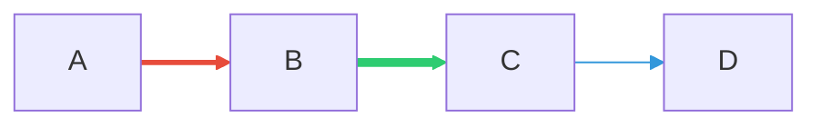
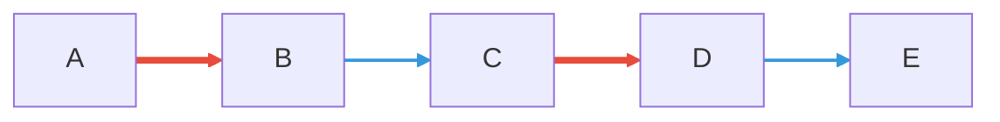
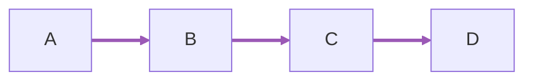
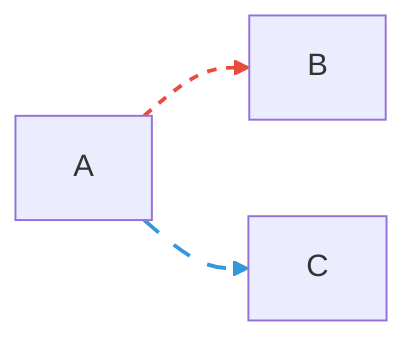
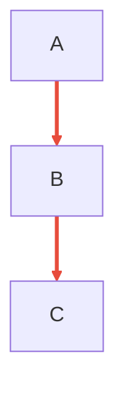
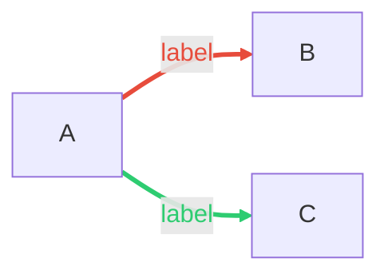
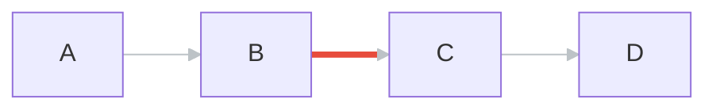

# Mermaid `linkStyle` Samples

## 1. Basic stroke color and width by index



## 2. Multiple indexes in one statement



## 3. `default` — applies to all links



## 4. Dashed lines via `stroke-dasharray`

> Note: in some Mermaid versions commas inside `stroke-dasharray` need to be escaped as `\,`



## 5. `fill:none` (prevents filled shape artifacts on edges)



## 6. `color` for label text (inconsistent across renderers)



## 7. `-` shorthand — attach style to the previous link (newer Mermaid only)

> May not work on GitHub, which uses a pinned older Mermaid version.

```mermaid
flowchart TD
  A --> B
  linkStyle - stroke:#e74c3c,stroke-width:3px
  B --> C
  linkStyle - stroke:#2ecc71,stroke-width:3px
  C --> D
  linkStyle - stroke:#3498db,stroke-width:3px
```

## 8. Mixing `default` with per-index overrides



---

## Notes

| Property | Support |
|---|---|
| `stroke` | Generally reliable |
| `stroke-width` | Most commonly broken — renderer may strip it |
| `color` | Label text color; most inconsistent across versions |
| `fill:none` | Worth including in `default` to prevent polygon artifacts |
| `-` shorthand | Newer Mermaid only; not yet on GitHub |
| Multiple indexes (`0,2`) | Works in recent Mermaid versions |